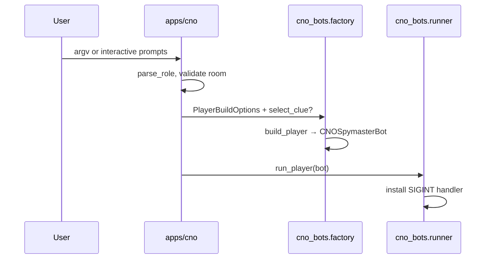
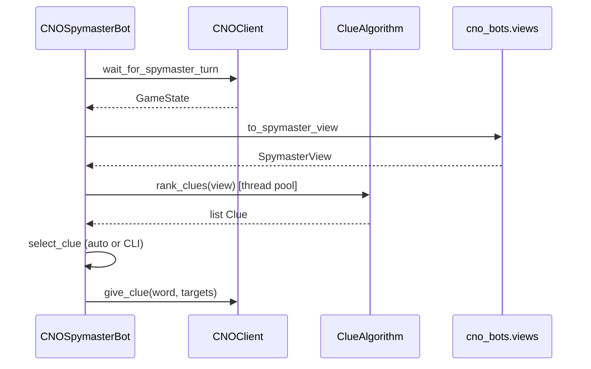
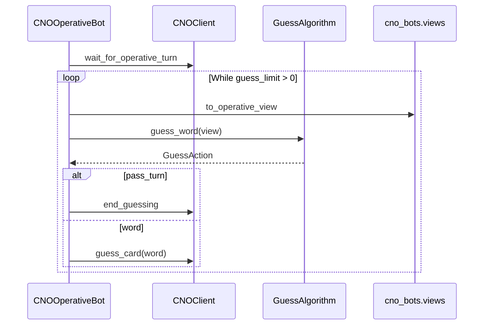

# Execution flow

How a single `uv run cno <room> red-spymaster` invocation runs through the layers.

## CLI startup

**Invariant:** CLI never calls `CNOClient` directly.

## Spymaster turn (one iteration)

**Invariant:** `ClueAlgorithm` is synchronous and receives only `SpymasterView` (full hidden colors).

## Operative turn (one guess)

**Invariant:** `OperativeView` omits unrevealed card colors; algorithms must not rely on hidden bucket information.

## Full four-bot match

`cno_bots.game.run_full_game` creates a room, seats four clients, starts the match, and runs four `play()` tasks with `Scripted*` algorithms in integration tests. Production CLI typically runs **one** bot per process.

See [CLI reference](../cli/reference.md) and [cno-bots implementation](../implementations/cno-bots.md).
