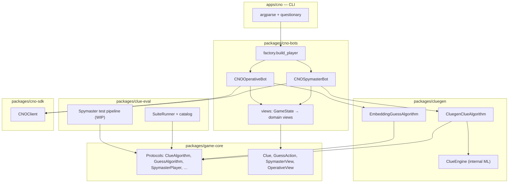

# Architecture overview

## Problem

Contributors need to experiment with **how bots decide clues and guesses** without re-implementing Socket.IO, room seating, or turn waiting—and to prove clue logic against a **predefined test catalog** (`clue-eval`). The codebase separates:

1. **Domain contracts** — what a spymaster or operative needs to see and return
2. **Algorithms** — pure decision logic (testable without network)
3. **Predefined clue tests** — `clue-eval` catalog any `ClueAlgorithm` can run through
4. **Spymaster test pipeline** — `clue-eval` full-game benchmark on stratified boards (WIP on `feature/spymaster-test-pipeline`)
5. **CNO players** — async loops that talk to codenames.game
6. **CLI** — human-facing argument and prompt layer
7. **Optional example ML** — `cluegen` (not part of the catalog)

!!! warning "Test pipeline in progress"
    The benchmark harness (simulation loop, operative agents, result JSON) is experimental and likely to be massively reworked. Treat it as a prototype, not a stable contract.

## Layer diagram

`clue-eval` is offline evaluation tooling; it does not participate in live bot loops.

## Dependency rules (invariants)

| Package | May import | Must not import |
|---------|------------|-----------------|
| `game-core` | stdlib only | `cno-sdk`, `cluegen`, `cno-bots` |
| `cluegen` | `game-core` | `cno-sdk`, `cno-bots` |
| `clue-eval` | `game-core` | `cluegen`, `cno-sdk`, `cno-bots` |
| `cluegen` (optional example) | `game-core` | `clue-eval`, `cno-sdk`, `cno-bots` |
| `cno-sdk` | stdlib + socket libs | `game-core`, `cluegen` |
| `cno-bots` | `game-core`, `cluegen`, `cno-sdk` | `questionary` |
| `apps/cno` | `cno-bots`, `questionary` | Implement game loops inline |

Violating these creates cycles and makes algorithms untestable against live servers.

## Extension points

| Extension point | When to use | Guide |
|-----------------|-------------|-------|
| `ClueAlgorithm` | New way to rank clues | [Adding a clue algorithm](../contributor-guides/adding-clue-algorithm.md) |
| `GuessAlgorithm` | New way to pick guesses | [Adding a guess algorithm](../contributor-guides/adding-guess-algorithm.md) |
| `GameBackend` | Non-CNO Codenames implementation | [Adding a game backend](../contributor-guides/adding-game-backend.md) |
| `select_clue` callback | Human-in-the-loop spymaster (CLI) | [Extend the CLI](../contributor-guides/extending-cli.md) |
| Spymaster test pipeline | Full-game benchmark vs fixed operatives (WIP) | [clue-eval](../implementations/clue-eval.md) |

`SpymasterPlayer` / `OperativePlayer` are implemented today only by CNO bots; new backends would add new player classes, not change the protocols.

## Related pages

- [Packages & boundaries](packages.md)
- [Execution flow](execution-flow.md)
- [ADR index](../adrs/index.md)
