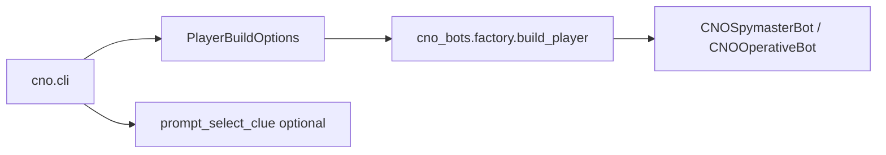

# Extend the CLI

## Problem

Operators need flags and prompts to choose room, role, algorithms, and human-in-the-loop clue selection without pulling game logic into `apps/cno`.

## When to change `apps/cno`

- New command-line flags
- New interactive prompts
- Different default nicknames or role aliases

## When **not** to change `apps/cno`

- Clue ranking logic → [`ClueAlgorithm`](adding-clue-algorithm.md)
- Guess logic → [`GuessAlgorithm`](adding-guess-algorithm.md)
- Socket.IO or turn waiting → `cno-sdk` / `cno-bots`

## Extension pattern

### Add a flag

1. `build_parser()` in `apps/cno/src/cno/cli.py` — add `argparse` argument
2. `_player_options()` — map flag to `PlayerBuildOptions` field or `select_clue`
3. `prompt_interactive()` — set defaults on `argparse.Namespace` for parity
4. [CLI reference](../cli/reference.md) — document the flag

### Human clue selection

`InteractiveCNOSpymasterBot` is not a separate class: pass `select_clue=prompt_select_clue` from `cno.interactive` into `PlayerBuildOptions`. The bot calls your callback with ranked clues.

### New default algorithm

Prefer extending `cno_bots.factory._build_spymaster` / `_build_operative` with an explicit option rather than importing heavy ML into the CLI package.

## Invariants

- `apps/cno` depends only on `cno-bots` + `questionary`
- `main()` ends with `run_player(build_player(...))` — keep that shape

## Related

- [CLI implementation](../implementations/cno-cli.md)
- [CLI reference](../cli/reference.md)
